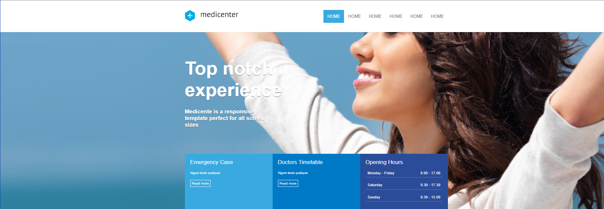
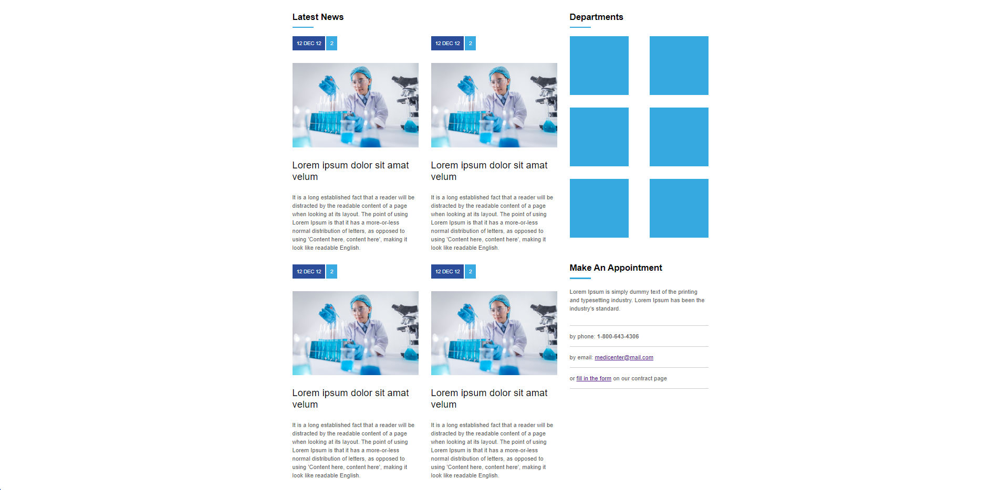
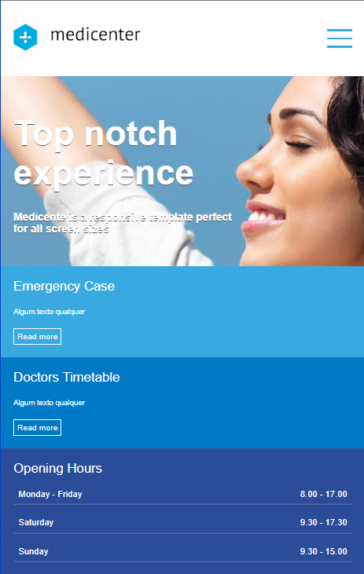
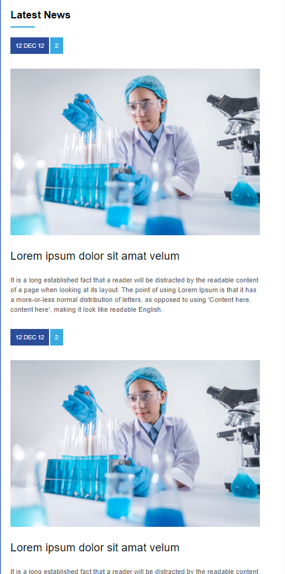
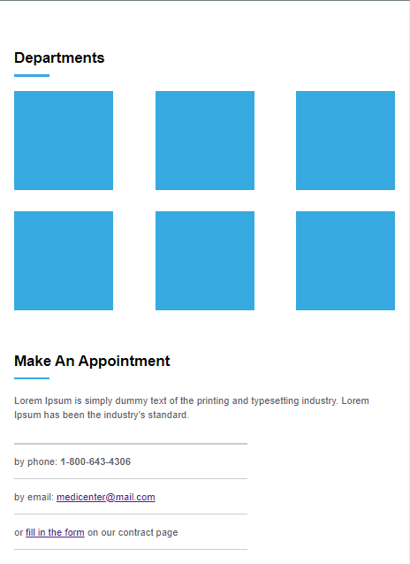
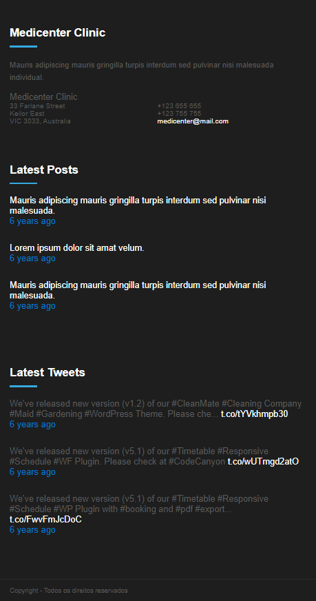
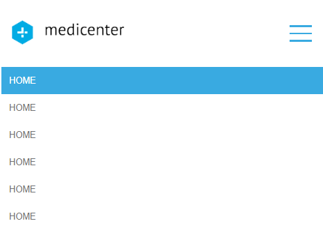

<h1 align="center">MediCenter</h1>

 

<h6 align="right">Largura 1920px</h6>

>Exercício

Projeto de reconstrução de um site modelo, juntamente com sua versão mobile.  
Curso de programação B7web.

[Clique aqui para acessar o site.](https://scgui.github.io/medicenter)

 

<kbd>

<kbd>

<kbd>

<kbd>

<kbd>

<h6 align="right">Largura 600px</h6>

- Navbar funcionando normalmente

 

<kbd></kbd>

 

## 🔧 Tecnologias

- HTML
- CSS
- Git e Github

## O que aprendi

- Aprimorar o uso do Flexbox
- O uso de responsividade na prática
- Pensar constantemente tanto no produto final quanto na sua versão mobile
- Encontrar padrões no site para diminuir o número de linhas de código e agilizar o processo

## 🔌 Contato

guics37.go@gmail.com
